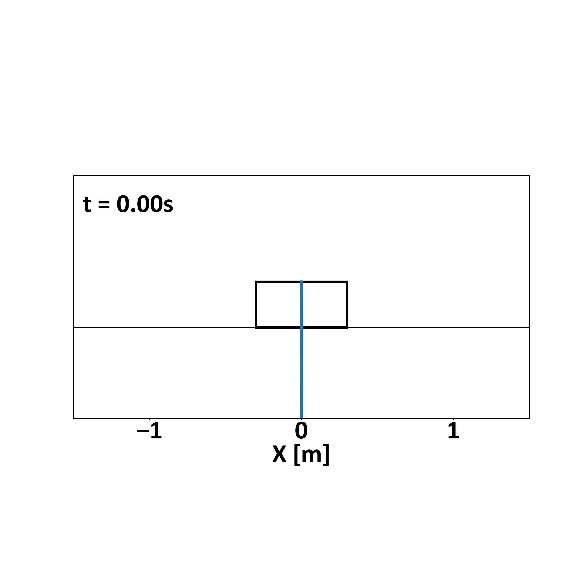

# MPPI Baseline Framework

This repository contains the Python baseline for:

**“Unifying Model Predictive Path Integral Control:  
From Stochastic Theory to Real-Time Implementation”**

This module provides:

- modular MPPI structure
- GPU-accelerated rollouts
- clean interfaces for extending MPPI
- simple simulation examples (Matplotlib)

It is intended primarily for research, teaching, and prototyping.


# Environment Setup

This package is designed to work inside a Python virtual environment
(e.g., Conda).  
ROS2 is **not required** for this part.


## 1) Create and activate environment
```bash
conda create -n mppi_framework python=3.10
conda activate mppi_framework
```
## 2) Install this package

Inside the repository root:
```bash
pip install -e .
```


## 3) Install PyTorch (Conda — recommended)

```bash
conda install pytorch=2.5.1 torchvision pytorch-cuda=11.8 -c pytorch -c nvidia
```
# Running Examples

Examples are located in:
mppi_framework/examples/


Example:
```bash
python examples/quadrotor3d_run.py
```

# Experimental Results

## cartpole



## mobile 2D


## quadrotor 3D


